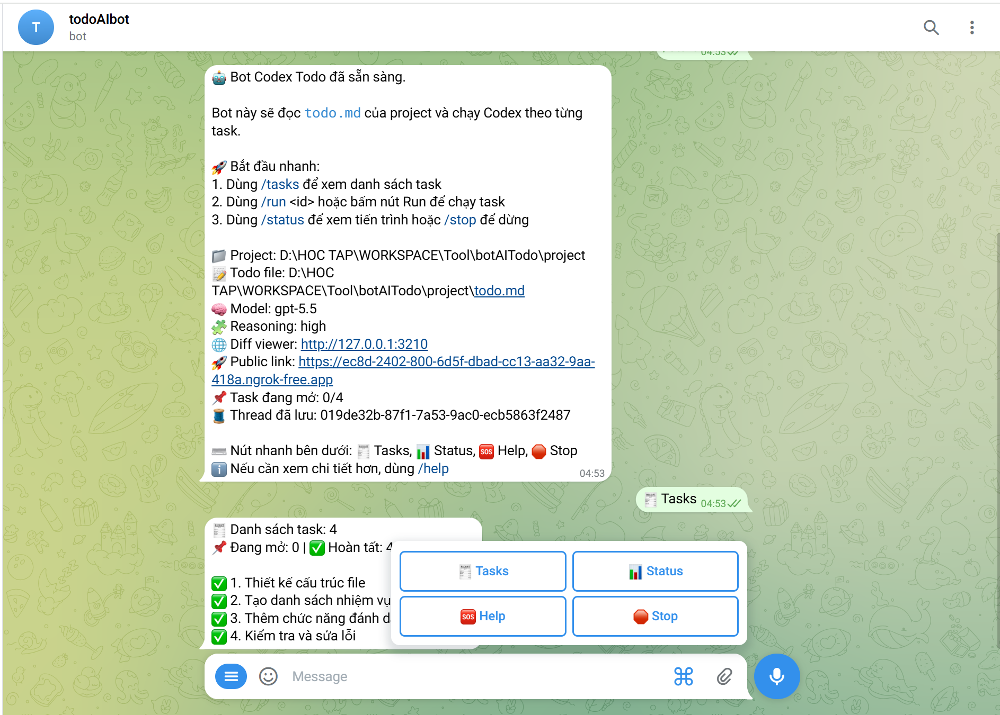

<p align="center">
  
</p>

# Codex Todo Telegram Bot

Telegram bot để điều khiển `codex` từ xa qua Telegram, theo từng task được viết trong `todo.md` của một project local.

Phù hợp khi bạn muốn giữ workflow đơn giản:

- project chạy trên máy local
- task được quản lý bằng `todo.md`
- Codex xử lý từng task theo ID
- trạng thái, diff và follow-up được theo dõi ngay trong Telegram

## Highlights

- Chạy task theo ID từ `todo.md`
- Xem danh sách task trực tiếp trong Telegram với nút `Run`
- Gửi follow-up prompt vào đúng Codex thread đang lưu bằng `/reply`
- Theo dõi tiến trình đang chạy với `/status`
- Dừng job hiện tại hoặc xóa session với `/stop`
- Mở diff viewer local hoặc public link qua tunnel
- Approve commit ngay từ Telegram với `/approve_commit`
- Tự kiểm tra config và môi trường trước khi bot bắt đầu polling

## How It Works

1. Bot đọc `config.json` để biết project nào sẽ được Codex thao tác.
2. Bot parse `todo.md` để lấy danh sách task theo ID như `1`, `1.2`, `2.1`.
3. Khi chạy `/run <id>`, bot gọi `codex` trong thư mục project đã cấu hình.
4. Kết quả và trạng thái được stream về Telegram.
5. Thread Codex được lưu lại để bạn tiếp tục bằng `/reply`.
6. Diff viewer hiển thị thay đổi hiện tại; nếu bật tunnel, bot sẽ trả public URL để mở từ Telegram.

## Requirements

- Node.js `18+`
- `codex` CLI có trong `PATH`
- Telegram bot token từ BotFather
- `chat_id` được phép sử dụng bot
- Tùy chọn: `cloudflared` hoặc `ngrok` nếu muốn public diff viewer

## Project Structure

```text
.
├── bot.js
├── src/
│   ├── app.js
│   ├── codex.js
│   ├── config.js
│   ├── constants.js
│   ├── diff-viewer.js
│   ├── git.js
│   ├── session.js
│   ├── telegram.js
│   └── todo.js
├── config.example.json
├── config.json
├── package.json
├── README.md
├── todo.md
└── web/
    ├── app.js
    ├── index.html
    └── styles.css
```

`bot.js` là entrypoint mỏng; phần logic chính đã được tách vào `src/` theo từng domain.

## Quick Start

### 1. Install dependencies

```bash
npm install
```

### 2. Create environment file

```bash
cp .env.example .env
```

Cấu hình tối thiểu trong `.env`:

```env
TELEGRAM_BOT_TOKEN=your_telegram_bot_token_here
ALLOWED_CHAT_ID=123456789
DIFF_VIEWER_TUNNEL=ngrok
```

### 3. Create runtime config

```bash
cp config.example.json config.json
```

Ví dụ:

```json
{
  "path": "/absolute/path/to/your/project",
  "todoFile": "todo.md",
  "model": "your-preferred-model",
  "reasoningEffort": "medium"
}
```

Ý nghĩa các trường:

| Field      | Required | Description                                            |
| ---------- | -------- | ------------------------------------------------------ |
| `path`     | Yes      | Đường dẫn tuyệt đối tới project mà Codex sẽ làm việc   |
| `todoFile` | No       | Tên file task bên trong project, mặc định là `todo.md` |
| `model`    | No       | Model truyền vào `codex --model`, có thể đổi bằng bot  |
| `reasoningEffort` | No | Reasoning effort, map sang `model_reasoning_effort`     |

### 4. Start the bot

```bash
node bot.js
```

Khi khởi động thành công, bot sẽ:

- validate `.env`, `config.json`, project path và `todo.md`
- kiểm tra `codex --version`
- khởi chạy diff viewer tại `http://127.0.0.1:3210` mặc định
- mở public tunnel nếu `DIFF_VIEWER_TUNNEL` được bật

## Telegram Commands

| Command           | Description                                       |
| ----------------- | ------------------------------------------------- |
| `/start`          | Kiểm tra bot đã sẵn sàng và xem onboarding ngắn   |
| `/help`           | Xem danh sách lệnh và config hiện tại             |
| `/diff`           | Lấy link diff viewer local/public                 |
| `/tasks`          | Xem danh sách task parse từ `todo.md`             |
| `/model`          | Xem model/reasoning hiện tại và chọn bằng nút     |
| `/model <name>`   | Đổi model thủ công cho các lần chạy tiếp theo     |
| `/reason <name>`  | Đổi reasoning effort thủ công cho các lần chạy tiếp theo |
| `/run <id>`       | Chạy task theo ID, ví dụ `/run 1` hoặc `/run 1.2` |
| `/reply <prompt>` | Gửi follow-up prompt vào Codex thread hiện tại    |
| `/status`         | Xem Codex có đang chạy hay không                  |
| `/stop`           | Dừng job đang chạy hoặc xóa session đã lưu        |
| `/approve_commit` | Stage toàn bộ thay đổi và commit nếu phù hợp      |

Ngoài slash commands, bot cũng có reply keyboard nhanh cho `Tasks`, `Status`, `Help`, `Stop`.

## Expected `todo.md` Format

Bot hỗ trợ các dòng task có ID dạng số hoặc phân cấp. Ví dụ:

```md
- [ ] 1. Setup authentication
- [ ] 1.1 Add login endpoint
- [x] 2. Refactor navbar
```

Task đã hoàn tất có thể đánh dấu `[x]`, bot vẫn parse được đầy đủ.

## Diff Viewer Tunnel

Diff viewer luôn chạy local. Nếu muốn mở từ điện thoại hoặc ngoài mạng nội bộ, cấu hình `DIFF_VIEWER_TUNNEL` trong `.env`.

| Value         | Description                                    |
| ------------- | ---------------------------------------------- |
| `none`        | Không public diff viewer                       |
| `cloudflared` | Dùng Cloudflare Tunnel                         |
| `ngrok`       | Dùng ngrok                                     |
| `auto`        | Thử `cloudflared` trước, fallback sang `ngrok` |

### `cloudflared`

```bash
cloudflared --version
```

Bot sẽ chạy:

```bash
cloudflared tunnel --url http://127.0.0.1:3210 --no-autoupdate
```

### `ngrok`

```bash
ngrok help
```

Bot sẽ chạy:

```bash
ngrok http http://127.0.0.1:3210 --log stdout
```

Nếu dùng `ngrok`, bạn có thể cần cấu hình auth token trước:

```bash
ngrok config add-authtoken <your-token>
```

## Workflow Gợi Ý

1. Mở `/tasks` để lấy ID task cần làm.
2. Chạy `/run <id>`.
3. Theo dõi bằng `/status`.
4. Mở `/diff` để xem thay đổi hiện tại.
5. Dùng `/model` để chọn model hoặc reasoning bằng nút.
6. Dùng `/model <name>` nếu muốn đổi model thủ công.
7. Dùng `/reason <minimal|low|medium|high|xhigh>` nếu muốn đổi reasoning thủ công.
8. Dùng `/reply` nếu muốn Codex sửa tiếp trong cùng thread.
9. Dùng `/approve_commit` khi muốn tạo commit từ task vừa hoàn tất.

## Notes

- Bot chỉ cho phép đúng `ALLOWED_CHAT_ID` sử dụng.
- Mỗi thời điểm chỉ xử lý một Codex job.
- Session Codex được lưu trong `.codex-session.json`.
- Có thể đổi model runtime bằng `/model`; bot sẽ ghi lại vào `config.json`.
- Có thể đổi reasoning effort runtime bằng `/reason`; bot sẽ ghi lại vào `config.json`.
- Khi dùng `/approve_commit`, bot sẽ dùng task hoàn tất gần nhất làm commit message.
- Nếu project chưa là git repo, bot sẽ thử `git init` trước khi commit.
- Không nên commit `.env`, `config.json` hoặc session file vào repo public.
